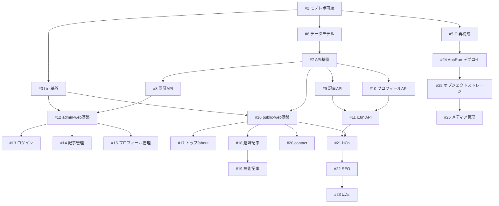

# [Epic] 公開サイト・管理画面・API を分離した構成で profile-hub v1 を構築する

| 項目 | 値 |
| ---- | -- |
| Issue | [#1](https://github.com/kishimin-ai-create/profile-hub/issues/1) |
| 英語タイトル | [Epic] Build profile-hub v1 as a separated public site, admin console, and API |
| マイルストーン | v1 |
| ラベル | epic,enhancement |

---

公開サイト・管理画面・API を独立したアプリケーションとして分離し、自己紹介サイト profile-hub を構築する。本Issueは v1 全体の要件と、分割した子Issueを束ねる親Issueとする。

## 解決したい課題

現在のリポジトリは前身プロジェクト Daybook (日記アプリ) の雛形が残っており、profile-hub として必要な要件・構成・実装が存在しない。

- `docs/v1/` の要件定義・仕様は Daybook (日記/PostgreSQL/Next.js) を前提としており、profile-hub の要件を表していない。
- `backend/` `frontend/` に設定ファイルのみが残り、実装ソースは削除済み。
- 公開サイトと管理画面が同一アプリに同居する構成では、公開側に管理用の認証・フォーム・依存関係が混入し、公開側のバンドルサイズと攻撃面が不必要に増える。

## 提案する解決策

公開サイト・管理画面・API を完全に分離したモノレポ構成にする。

```
repo
├── apps
│   ├── public-web      # 公開サイト (認証不要)
│   ├── admin-web       # 管理画面 (管理者のみ)
│   └── api             # Hono API
├── packages
│   ├── ui              # 共有UIコンポーネント
│   ├── types           # 共有型
│   ├── config          # 共有Lint/TS/ビルド設定
│   └── utils           # 共有ユーティリティ
└── infra               # さくらのクラウド構成
```

### 技術スタック

| 領域 | 採用 |
| ---- | ---- |
| パッケージマネージャ / ランタイム | Bun |
| public-web | Vite + React + TanStack Router (SPA + ビルド時prerender) |
| admin-web | Vite + React + TanStack Router (SPA) |
| API | Hono |
| DB | MySQL |
| ORM | Drizzle ORM |
| 認証 | JWT |
| ストレージ | さくらのオブジェクトストレージ (S3互換) |
| クラウド | さくらのクラウド AppRun (コンテナ) |
| Lint | mojica (https://github.com/kishimin/mojica) と同一ルール |

### 責務

**public-web** — 自己紹介、趣味ページ、エンジニアページ、i18n、SEO、広告表示。API からデータを取得する。認証不要。

**admin-web** — 管理者ログイン、プロフィール編集、記事CRUD、スキルCRUD、SNSリンクCRUD、お知らせCRUD、公開/下書き管理。管理者のみ利用。

**api** — JWT認証、CRUD API、多言語データ管理。v2 で画像アップロードを追加する。

### 画面構成

```
public                    admin
/                         /login
├── about                 /dashboard
├── hobby                 /profile
│   ├── 一覧              /articles
│   └── 詳細              /articles/new
├── engineering           /articles/:id
│   ├── 一覧              /settings
│   └── 詳細
└── contact
```

### データモデル方針

記事は `Article` 1テーブルで趣味・技術の双方を管理する。

- `type` — `hobby` / `engineering`
- `status` — `draft` / `published`

将来カテゴリ (旅行・登壇・制作実績など) を増やす場合も `type` の追加のみで拡張でき、カテゴリ・タグ・翻訳の仕組みを共通化できる。

## 代替案

- **public-web を Next.js App Router にする** — SSG/ISR により SEO は有利だが、mojica の Vite 前提の ESLint・Vitest・Storybook 設定をそのまま流用できず、2種類の Lint 構成を維持する必要がある。SPA + ビルド時prerender で SEO 要件を満たす方針を採用したため不採用。
- **公開サイトと管理画面を単一アプリに統合する** — 実装量は減るが、公開側に管理機能の依存とルートが混入する。分離を優先して不採用。
- **記事を趣味用・技術用の別テーブルに分ける** — カテゴリ追加のたびにテーブル・API・管理画面が増える。`Article.type` による統合を採用して不採用。

## 受入条件

- [ ] 子Issueがすべてクローズされている
- [ ] 未ログインの利用者が公開サイトで自己紹介・趣味記事・技術記事を閲覧できる
- [ ] 管理者がログインし、記事・プロフィール・スキル・SNSリンク・お知らせを管理できる
- [ ] 下書き記事が公開サイトに一切表示されない
- [ ] 公開サイトが日本語と英語で表示できる
- [ ] 公開サイトの各ページがクローラーに対して本文を含む HTML を返す
- [ ] さくらのクラウド AppRun 上で 3 アプリが稼働している

## 対象外

- メディア管理 (画像アップロード) — v2
- コメント、いいね、記事検索、RSS
- 管理者の複数アカウント運用、権限ロールの細分化

## 補足

- v1 スコープ: 公開サイト + 記事CRUD + 認証 + i18n(ja/en) + 広告表示
- Lint ルールの参照元: https://github.com/kishimin/mojica

---

## 子Issue

### 基盤

- [ ] #2 モノレポ構成 (apps / packages / infra) へ再編する
- [ ] #3 フロントエンドの Lint 基盤を mojica と同一ルールで整備する
- [ ] #4 要件定義・仕様ドキュメントを profile-hub 用に刷新する
- [ ] #5 CI をモノレポ + Bun 構成に合わせて再構成する

### API

- [ ] #6 MySQL のデータモデルを確定し Drizzle スキーマを実装する
- [ ] #7 Hono API の基盤 (ルーティング・検証・エラー・OpenAPI) を構築する
- [ ] #8 管理者向け JWT 認証 API を実装する
- [ ] #9 記事 CRUD API を実装する
- [ ] #10 プロフィール関連 API を実装する
- [ ] #11 DB コンテンツの多言語対応 (ja/en) を API に実装する

### admin-web

- [ ] #12 admin-web のアプリ基盤と認証ガードを構築する
- [ ] #13 管理者ログイン画面を実装する
- [ ] #14 記事管理画面 (一覧・作成・編集・公開/下書き) を実装する
- [ ] #15 プロフィール・スキル・SNSリンク・お知らせの管理画面を実装する

### public-web

- [ ] #16 public-web のアプリ基盤と共通レイアウトを構築する
- [ ] #17 トップページと about ページを実装する
- [ ] #18 趣味記事の一覧・詳細ページを実装する
- [ ] #19 技術記事の一覧・詳細ページを実装する
- [ ] #20 contact ページを実装する
- [ ] #21 公開サイトの i18n (ja/en) を実装する
- [ ] #22 公開サイトの SEO 対応 (prerender / メタ情報 / OGP / sitemap) を実装する
- [ ] #23 公開サイトに広告表示を実装する

### インフラ

- [ ] #24 さくらのクラウド AppRun へのデプロイを構築する

### v2

- [ ] #25 さくらのオブジェクトストレージ (S3互換) との連携を実装する
- [ ] #26 メディア管理 (画像アップロード・一覧) を実装する

## 着手順

依存関係の都合上、次の順序で進める。



`#4` (ドキュメント刷新) は `#6` のデータモデル決定と並行して進め、決定内容を反映する。


---

## デザインレビューによる更新 (2026-09-04)

### 子Issueの追加

デザインレビューの結果、デザイン系のIssueを6件追加した。

- #27 デザインのコントラスト不足を修正する
- #28 Figmaファイルのレイアウト・コンポーネント不具合を修正する
- #29 モバイルアートボードを追加しブレイクポイントを定義する
- #30 不足している操作状態のデザインを追加する
- #31 v1に不足している画面を設計する
- #32 デザイントークンを定義する

着手順としては #27 #28 を先に片付け、その上で #29 #30 #31 へ進む。#32 は #27 の結果を取り込み、`packages/config` を通じて #2 #3 と #12 #16 に影響する。

### デザインの参照先

Figma ファイル `cl17hpDO7KrU9S6WYPvILk` "profile-hub — Public & Admin UI"。レビュー結果は `review/figma-ui-design-20260904.md`。
